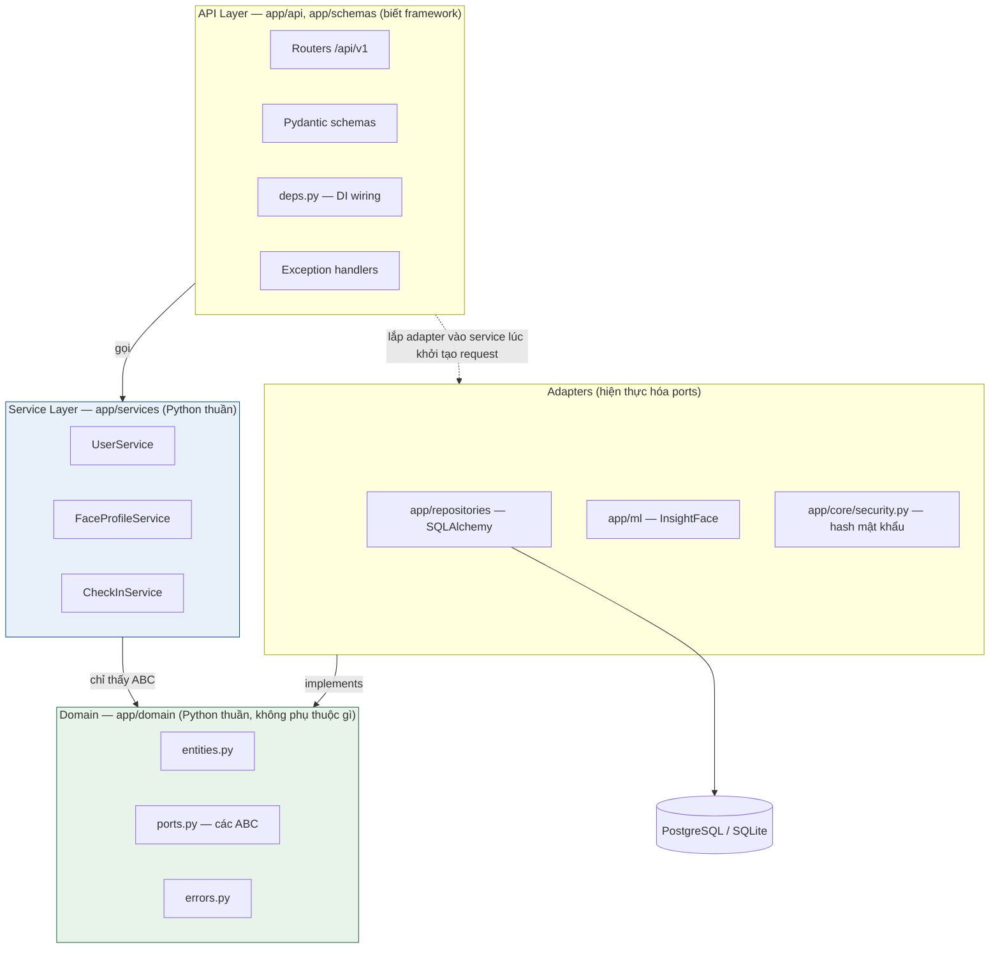
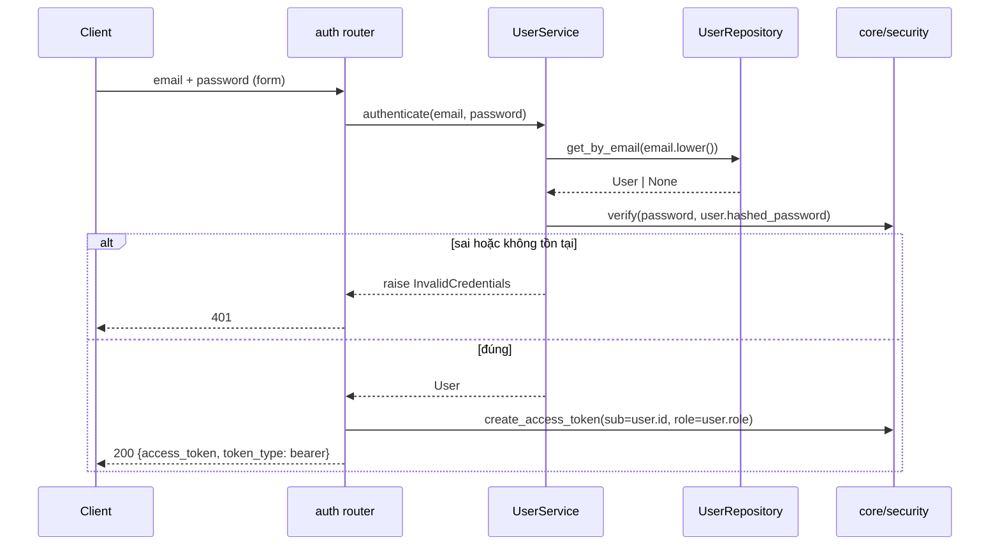
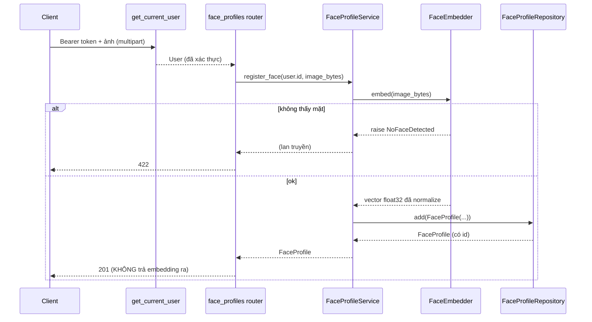
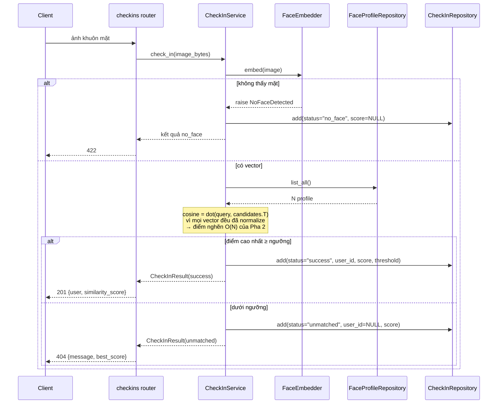

# Kiến trúc hệ thống — Face Check-in Backend

> Tài liệu kiến trúc Pha 1. Đi kèm [erd.md](erd.md) (mô hình dữ liệu) và [ke-hoach-8-tuan.md](ke-hoach-8-tuan.md) (kế hoạch, API spec, RACI).
> Đối tượng đọc: 3 thành viên trong nhóm, **và nhóm sẽ tiếp nhận hệ thống này ở Pha 2** — viết như thể người đọc không hỏi lại được ai.

## 1. Ràng buộc từ đề bài → quyết định kiến trúc

Mọi quyết định dưới đây đều truy ngược được về một dòng trong [2026.md](2026.md). Không có quyết định nào "vì thấy hay":

| Yêu cầu đề bài | Quyết định kiến trúc | Kiểm chứng ở đâu |
|---|---|---|
| "Phân tầng rõ: API → Nghiệp vụ → Truy cập dữ liệu" | 3 tầng + thư mục tách bạch (mục 3, 4) | Cấu trúc thư mục, `import-linter` |
| "Tầng nghiệp vụ **không import** framework web hay thư viện DB" | Service chỉ phụ thuộc ABC trong `app/domain/ports.py` (mục 5, 6) | `import-linter` contract 1 (mục 14) |
| "Truy cập dữ liệu qua Repository/DAO, bên dưới dùng ORM" | Repository ABC + implementation SQLAlchemy (mục 6) | `app/repositories/` |
| "Xác thực qua middleware/filter/interceptor, **không viết lặp** trong từng endpoint" | Một `get_current_user` gắn ở **cấp router** (mục 8) | Không handler nào tự decode JWT |
| "Ít nhất 1 GET và 1 POST cần xác thực" | `GET /auth/me`, `GET /checkins`, `POST /face-profiles` (mục 8) | Swagger hiện ổ khóa |
| "REST API, JSON, có POST/GET/DELETE" | Router `/api/v1/*` (mục 7) | OpenAPI tự sinh |
| "Có tài liệu API (OpenAPI/Swagger)" | FastAPI tự sinh tại `/docs` + xuất `openapi.json` tĩnh | Checklist bàn giao Tuần 6 |
| "Hỗ trợ đóng gói Docker" | Dockerfile multi-stage + docker-compose (mục 12) | Tuần 5 |
| "Kiểm thử tải trên Kaggle CPU" | Suy luận model chạy CPU, không phụ thuộc GPU (mục 9) | Tuần 6 |

---

## 2. Tổng quan một câu

> Một FastAPI service phân 3 tầng, trong đó **tầng nghiệp vụ là Python thuần** — nó không biết HTTP tồn tại, cũng không biết dữ liệu nằm ở Postgres hay SQLite — nhờ đó so khớp khuôn mặt và phân quyền đều test được mà không cần dựng DB hay web server.

---

## 3. Sơ đồ tầng & quy tắc phụ thuộc



### Quy tắc phụ thuộc (bảng này là luật, không phải gợi ý)

| Tầng | ĐƯỢC import | CẤM import |
|---|---|---|
| `app/domain` | stdlib, `numpy` | Tất cả phần còn lại của `app`, mọi thư viện web/DB |
| `app/services` | `app.domain`, stdlib, `numpy` | `fastapi`, `starlette`, `sqlalchemy`, `pydantic`, `app.api`, `app.models`, `app.repositories`, `app.schemas` |
| `app/repositories` | `app.domain`, `app.models`, `sqlalchemy` | `app.api`, `app.services`, `fastapi` |
| `app/ml` | `app.domain`, `numpy`, `insightface`/`onnxruntime` | `app.api`, `app.services`, `sqlalchemy` |
| `app/api` | Tất cả (đây là **composition root** — nơi duy nhất được lắp mọi thứ lại) | — |

**Mũi tên phụ thuộc luôn chỉ vào trong.** `app/domain` là lõi không phụ thuộc ai; adapter ở ngoài cùng phụ thuộc vào lõi, không bao giờ ngược lại. Đây chính là Dependency Inversion mà đề bài đòi hỏi.

### ⚠️ Cái bẫy `__init__.py` — đọc kỹ, đây là lỗi dễ mắc nhất

`app/repositories/__init__.py` **phải để trống**. Nếu ai đó viết cho tiện:

```python
# app/repositories/__init__.py  ← SAI
from .user_repository import SqlAlchemyUserRepository
```

thì bất kỳ dòng `import app.repositories...` nào cũng kéo theo SQLAlchemy. Chỉ cần một import kiểu đó lọt vào tầng Service là **vi phạm yêu cầu bắt buộc của đề bài** mà mắt thường rất khó thấy — code vẫn chạy bình thường, chỉ mất điểm khi chấm. `import-linter` ở mục 14 bắt được ca này; chạy nó trong CI từ Tuần 3, đừng đợi Tuần 5.

---

## 4. Cấu trúc thư mục

```
app/
├── main.py                  # tạo FastAPI app, gắn router + middleware + handler
├── core/
│   ├── config.py            # pydantic-settings, đọc .env
│   ├── security.py          # hash/verify mật khẩu, encode/decode JWT
│   └── logging.py           # cấu hình log (JSON log — điểm cộng A7)
├── domain/                  # ❤️ LÕI — Python thuần, không phụ thuộc gì
│   ├── entities.py          # User, FaceProfile, CheckInRecord (dataclass)
│   ├── ports.py             # các ABC: *Repository, FaceEmbedder, PasswordHasher
│   └── errors.py            # EmailAlreadyExists, NoFaceDetected, ...
├── services/                # nghiệp vụ, Python thuần
│   ├── user_service.py
│   ├── face_profile_service.py
│   └── checkin_service.py
├── models/                  # SQLAlchemy ORM models + Base + naming convention
├── repositories/            # adapter: implements *Repository bằng SQLAlchemy
│   ├── __init__.py          # ⚠️ ĐỂ TRỐNG (xem mục 3)
│   ├── user_repository.py
│   ├── face_profile_repository.py
│   ├── checkin_repository.py
│   └── mappers.py           # ORM ↔ domain entity
├── ml/                      # adapter: implements FaceEmbedder
│   └── insightface_embedder.py
├── schemas/                 # Pydantic DTO cho request/response
└── api/
    ├── deps.py              # DI: get_db, get_current_user, factory các service
    ├── errors.py            # map domain error → HTTP status
    ├── middleware.py        # request-id, logging, (tùy chọn) auth middleware
    └── v1/
        ├── auth.py
        ├── users.py
        ├── face_profiles.py
        └── checkins.py

alembic/                     # migration
scripts/                     # seed data, manual_test_repo.py, benchmark
tests/
├── unit/                    # test service với port giả — không DB, không HTTP
├── integration/             # test repository với DB thật
└── api/                     # test endpoint với TestClient
```

**So với danh sách thư mục chốt ở Tuần 1**, tài liệu này bổ sung 3 thư mục, mỗi cái có lý do bắt buộc:

| Thư mục thêm | Vì sao không thể thiếu |
|---|---|
| `app/domain/` | Cả `services` và `repositories` đều cần dùng chung entity + ABC. Nếu để ABC trong `repositories/` thì Service phải import `repositories` → dễ kéo theo SQLAlchemy (mục 3). `domain/` là nơi duy nhất trung lập |
| `app/ml/` | InsightFace/onnxruntime là dependency nặng. Cô lập vào một thư mục để Pha 2 thay bằng bản ONNX quantized chỉ cần sửa 1 file |
| `app/core/` | Config và primitive bảo mật (hash, JWT) không thuộc tầng nào trong 3 tầng — chúng là hạ tầng dùng chung |

---

## 5. Trách nhiệm từng tầng

### 5.1. Domain (`app/domain/`) — lõi

Không có logic điều phối, chỉ có **dữ liệu và hợp đồng**.

```python
# entities.py — không kế thừa gì, không decorator của framework
@dataclass(frozen=True, slots=True)
class FaceProfile:
    id: int | None
    user_id: int
    embedding: np.ndarray  # đã L2-normalize, float32
    model_name: str
    created_at: datetime


# ports.py — hợp đồng mà tầng ngoài phải thỏa mãn
class FaceProfileRepository(ABC):
    @abstractmethod
    def add(self, profile: FaceProfile) -> FaceProfile: ...
    @abstractmethod
    def list_all(self) -> list[FaceProfile]: ...
    @abstractmethod
    def get(self, profile_id: int) -> FaceProfile | None: ...
    @abstractmethod
    def delete(self, profile_id: int) -> None: ...


class FaceEmbedder(ABC):
    @abstractmethod
    def embed(self, image_bytes: bytes) -> np.ndarray:
        """Trả vector float32 đã L2-normalize. Raise NoFaceDetected nếu không thấy mặt."""
```

> **numpy có được phép ở đây không?** Có. Đề bài cấm "framework web" và "thư viện DB" — numpy không thuộc cả hai, nó là thư viện tính toán thuần. Nếu muốn tuyệt đối sạch có thể dùng `tuple[float, ...]`, nhưng cái giá là mất hiệu năng vector hóa ở đúng chỗ nóng nhất. Quyết định này nên được ghi thành 1 ADR để nhóm nhận hệ thống không hiểu lầm.

### 5.2. Service (`app/services/`) — nghiệp vụ

Nhận port qua constructor, **không tự tạo ra thứ gì có kết nối ra ngoài**:

```python
class FaceProfileService:
    def __init__(
        self,
        profiles: FaceProfileRepository,  # ABC, không phải class SQLAlchemy
        users: UserRepository,
        embedder: FaceEmbedder,  # ABC, không phải InsightFace
        clock: Callable[[], datetime] = lambda: datetime.now(timezone.utc),
    ) -> None: ...

    def register_face(self, user_id: int, image: bytes) -> FaceProfile:
        if self._users.get(user_id) is None:
            raise UserNotFound(user_id)
        vector = self._embedder.embed(image)  # có thể raise NoFaceDetected
        return self._profiles.add(
            FaceProfile(
                id=None,
                user_id=user_id,
                embedding=vector,
                model_name=self._embedder.model_name,
                created_at=self._clock(),
            )
        )
```

Nhờ vậy unit test chạy **không cần DB, không cần model AI, không cần HTTP** — truyền vào 2 repository giả và 1 embedder trả vector cố định là đủ.

### 5.3. Repository (`app/repositories/`) — adapter dữ liệu

Nơi **duy nhất** được phép chuyển đổi ORM ↔ domain:

```python
class SqlAlchemyFaceProfileRepository(FaceProfileRepository):
    def __init__(self, session: Session) -> None:
        self._session = session

    def add(self, profile: FaceProfile) -> FaceProfile:
        row = FaceProfileORM(
            user_id=profile.user_id,
            embedding=profile.embedding.astype(np.float32).tobytes(),
            embedding_dim=profile.embedding.shape[0],
            model_name=profile.model_name,
            created_at=profile.created_at,
        )
        self._session.add(row)
        self._session.commit()
        self._session.refresh(row)
        return to_domain(row)
```

**Không bao giờ trả `FaceProfileORM` ra ngoài.** Object ORM gắn với session — thoát ra khỏi repository là mở đường cho lazy-load lỗi, `DetachedInstanceError`, và làm hỏng phân tầng.

### 5.4. API (`app/api/`, `app/schemas/`) — vỏ ngoài

Chỉ làm 4 việc: xác thực → chuyển request thành kiểu domain → gọi service → chuyển kết quả/lỗi thành HTTP. **Không có `if` nghiệp vụ nào trong router.**

```python
@router.post("", response_model=FaceProfileRead, status_code=201)
def register_face(
    file: UploadFile,
    current: User = Depends(get_current_user),
    service: FaceProfileService = Depends(get_face_profile_service),
):
    profile = service.register_face(current.id, file.file.read())
    return FaceProfileRead.model_validate(profile)
```

---

## 6. Ports & Adapters — bảng tra cứu

| Port (ABC trong `domain/ports.py`) | Adapter Pha 1 | Adapter giả khi test | Đường thay ở Pha 2 |
|---|---|---|---|
| `UserRepository` | `repositories/user_repository.py` | dict trong bộ nhớ | thêm lớp cache Redis bọc ngoài |
| `FaceProfileRepository` | `repositories/face_profile_repository.py` | dict trong bộ nhớ | cache embedding / ANN index |
| `CheckInRepository` | `repositories/checkin_repository.py` | list trong bộ nhớ | async driver, ghi theo lô |
| `FaceEmbedder` | `ml/insightface_embedder.py` | trả vector cố định | ONNX + quantization int8 |
| `PasswordHasher` | `core/security.py` (bcrypt/argon2) | hash giả, nhanh | — |

Cột cuối là lý do quan trọng nhất của toàn bộ thiết kế này: **mọi cải tiến Pha 2 đều thay được một adapter mà không đụng vào tầng Service.** Cột này cũng trả lời trước câu hỏi giảng viên hay hỏi: *"kiến trúc của em hỗ trợ cải tiến như thế nào?"*

> Mẹo test: adapter giả nên viết tay (~15 dòng dict) thay vì `unittest.mock.Mock`. Mock sẽ *im lặng chấp nhận* cả những lời gọi sai chữ ký, còn class giả kế thừa ABC thì báo lỗi ngay — test bắt được nhiều bug hơn.

---

## 7. Luồng xử lý chính

### 7.1. Đăng nhập — `POST /api/v1/auth/login`



**Chi tiết dễ bỏ sót:** khi email không tồn tại, vẫn nên chạy một phép verify giả rồi mới trả 401 — nếu không, thời gian phản hồi giữa "email sai" và "mật khẩu sai" khác nhau rõ rệt, cho phép dò email có tồn tại hay không. Và luôn trả **cùng một thông điệp lỗi** cho cả hai trường hợp.

**Vì sao tạo JWT nằm ở router chứ không ở Service?** Token là chi tiết của lớp vận chuyển HTTP — một client gRPC hay CLI sẽ cần cơ chế khác. Service chỉ trả lời câu hỏi nghiệp vụ *"cặp email/mật khẩu này có hợp lệ không"*. Đây là câu hỏi bảo vệ đồ án rất dễ bị hỏi, nên nhớ lý do.

### 7.2. Đăng ký khuôn mặt — `POST /api/v1/face-profiles` 🔒



Kiểm tra ở tầng API trước khi chạm tới model: giới hạn dung lượng file (`MAX_UPLOAD_MB`), chặn content-type ngoài `image/jpeg|png`. Suy luận model là thao tác tốn nhất trong toàn hệ thống — đừng để một file 200 MB đi tới được đó.

### 7.3. Check-in — `POST /api/v1/checkins` (luồng lõi)



**Cả 3 nhánh đều ghi bản ghi check-in**, kể cả thất bại — lịch sử thất bại chính là dữ liệu để hiệu chỉnh ngưỡng ở Tuần 3–4 và để so sánh ở Pha 2.

### 7.4. Xem lịch sử — `GET /api/v1/checkins` 🔒

Quy tắc phân quyền nằm ở **Service**, không phải ở router:

```python
def list_checkins(self, requester: User, user_id: int | None, ...) -> list[CheckInRecord]:
    if requester.role != Role.ADMIN:
        user_id = requester.id      # user thường: ép về chính mình, bỏ qua tham số truyền vào
    return self._checkins.list(user_id=user_id, start=start, end=end, limit=limit)
```

Nếu viết `if role == admin` trong router thì mỗi endpoint mới lại phải nhớ lặp lại — đúng thứ đề bài cấm. Đặt ở Service thì unit test phủ được mà không cần dựng HTTP.

---

## 8. Xác thực & phân quyền

### Thiết kế

```python
# app/api/deps.py — viết MỘT LẦN
oauth2 = OAuth2PasswordBearer(tokenUrl="/api/v1/auth/login")


def get_current_user(
    token: str = Depends(oauth2),
    users: UserRepository = Depends(get_user_repository),
) -> User:
    payload = decode_token(token)  # raise InvalidToken nếu hỏng/hết hạn
    user = users.get(int(payload["sub"]))
    if user is None:
        raise InvalidCredentials()
    return user


def require_admin(current: User = Depends(get_current_user)) -> User:
    if current.role != Role.ADMIN:
        raise PermissionDenied()
    return current
```

Gắn ở **cấp router**, không phải từng handler:

```python
# app/api/v1/checkins.py
router = APIRouter(
    prefix="/checkins",
    dependencies=[Depends(get_current_user)],  # ← áp cho MỌI endpoint trong router
)
```

Với endpoint cần quyền admin (`DELETE /checkins/{id}`, `POST /users`), thêm `dependencies=[Depends(require_admin)]` ở chính route đó.

### Bản đồ quyền

| Endpoint | Ai gọi được | Ghi chú |
|---|---|---|
| `POST /auth/login` | công khai | |
| `GET /auth/me` 🔒 | mọi user đã đăng nhập | **endpoint GET có auth #1 theo đề bài** |
| `POST /users` 🔒 | chỉ admin | |
| `GET /users/{id}` 🔒 | admin, hoặc chính chủ | kiểm tra trong Service |
| `POST /face-profiles` 🔒 | mọi user đã đăng nhập | **endpoint POST có auth theo đề bài** |
| `DELETE /face-profiles/{id}` 🔒 | admin, hoặc chủ hồ sơ | kiểm tra trong Service |
| `POST /checkins` | công khai | đây là "cái máy chấm công" ở cửa — người check-in chưa đăng nhập |
| `GET /checkins` 🔒 | user thường chỉ thấy của mình; admin thấy tất cả | **endpoint GET có auth #2** |
| `DELETE /checkins/{id}` 🔒 | chỉ admin | |

### Về chữ "middleware" trong đề bài

Đề bài viết "middleware/filter/interceptor". FastAPI dependency gắn ở cấp router **đúng tinh thần** (viết một lần, áp cho nhiều endpoint) và là cách làm chuẩn của framework này. Nếu muốn chắc chắn không bị trừ điểm vì câu chữ, bổ sung thêm một `BaseHTTPMiddleware` chặn tiền tố `/api/v1/protected/*`.

> Nếu làm cả hai, **đừng để chúng trùng đường dẫn**. Middleware chạy trước, dependency chạy sau — cùng một path sẽ tra DB hai lần cho mỗi request, làm hỏng số liệu benchmark ở Tuần 6 theo cách rất khó truy.

---

## 9. Thuật toán so khớp khuôn mặt

### Công thức

Mọi embedding đã được L2-normalize khi ghi (xem [erd.md](erd.md) mục 3), nên:

```
cosine_similarity(a, b) = dot(a, b)        vì ||a|| = ||b|| = 1
```

```python
# app/services/checkin_service.py
candidates = self._profiles.list_all()  # N profile
matrix = np.stack([p.embedding for p in candidates])  # (N, 512)
scores = matrix @ query  # (N,) — một phép nhân ma trận
best = int(np.argmax(scores))
if scores[best] >= self._threshold:
    ...  # success
```

Viết dưới dạng **một phép nhân ma trận** thay vì vòng `for` gọi `np.dot` từng cái — chênh lệch hàng chục lần, và đây đúng là đoạn code sẽ bị soi ở Pha 2.

### Ngưỡng similarity

| Điểm | Ý nghĩa |
|---|---|
| Giá trị khởi điểm | **0.35–0.45** cho embedding họ ArcFace/InsightFace |
| Cách chốt | **Phải tự hiệu chỉnh**: thu ~20 cặp ảnh cùng người + ~20 cặp khác người của chính nhóm, vẽ phân bố điểm, chọn ngưỡng tách hai cụm |
| Nơi cấu hình | Biến môi trường `SIMILARITY_THRESHOLD`, **không hard-code** |
| Vì sao lưu vào DB | Ngưỡng đổi theo thời gian; không lưu thì lịch sử check-in cũ mất ý nghĩa (xem erd.md mục 4) |

Đừng tin con số mặc định của thư viện: ngưỡng phụ thuộc model, độ phân giải ảnh và chất lượng camera. Hiệu chỉnh ở **Tuần 3**, ngay khi embedding thật chạy end-to-end, đừng để tới Tuần 6.

### Điểm nghẽn đã biết trước (nguyên liệu cho Pha 2)

| Giai đoạn | Chi phí ước tính | Tăng theo |
|---|---|---|
| Detect + embed 1 ảnh | ~50–200 ms CPU | cố định theo ảnh |
| Load N profile từ DB | tăng tuyến tính | N |
| Nhân ma trận (N=2 000) | dưới 1 ms | N |

Ở quy mô đồ án, **suy luận model là điểm nghẽn, không phải so khớp**. Nhưng đây mới là ước lượng — Tuần 6 phải đo thật rồi mới chốt cải tiến, đúng nguyên tắc "không chọn cứng trước khi đo" trong kế hoạch.

Model được **nạp một lần lúc khởi động** (singleton trong `app/ml/`), không nạp theo từng request — nạp lại mỗi request sẽ khiến throughput sụp xuống vài req/s và làm benchmark vô nghĩa.

---

## 10. Session & transaction

**Lựa chọn Pha 1: session theo request, repository tự commit.**

```python
# app/api/deps.py
def get_db() -> Iterator[Session]:
    with SessionLocal() as session:
        yield session
```

| Tiêu chí | Cách đang chọn (repository commit) | Cách thay thế (Unit of Work) |
|---|---|---|
| Độ phức tạp | Thấp — đọc code là hiểu | Thêm 1 port + 1 adapter |
| Ghi nhiều bảng trong 1 transaction | Không làm được | Làm được |
| Phù hợp Pha 1? | **Có** — mọi use-case hiện tại chỉ ghi 1 bảng | Thừa |

**Khi nào phải đổi:** ngay khi xuất hiện use-case ghi ≥ 2 bảng cần toàn vẹn (ví dụ Pha 2 thêm idempotency key: ghi `check_in_records` + `idempotency_keys` phải cùng thành hoặc cùng bại). Lúc đó thêm port `UnitOfWork` với `commit()`/`rollback()` và chuyển commit từ repository lên service. Ghi sẵn điều kiện này vào ADR để nhóm Pha 2 không phải tự đoán.

---

## 11. Xử lý lỗi

Service **chỉ ném lỗi domain**, không biết mã HTTP. API layer dịch sang HTTP ở một chỗ duy nhất (`app/api/errors.py`):

| Lỗi domain | HTTP | Body trả về |
|---|---|---|
| `InvalidCredentials` | 401 | thông điệp chung, không nói rõ sai email hay sai mật khẩu |
| `PermissionDenied` | 403 | |
| `UserNotFound`, `FaceProfileNotFound`, `CheckInNotFound` | 404 | |
| `EmailAlreadyExists` | 409 | |
| `NoFaceDetected` | 422 | gợi ý chụp lại rõ mặt |
| `UnmatchedFace` | 404 | kèm `best_score` để hỗ trợ hiệu chỉnh ngưỡng |
| Pydantic validation | 422 | FastAPI tự xử lý |
| Ngoại lệ chưa lường | 500 | **chỉ trả `request_id`**, chi tiết ghi vào log |

```python
# app/api/errors.py
@app.exception_handler(DomainError)
def handle_domain_error(request: Request, exc: DomainError):
    status = ERROR_STATUS_MAP.get(type(exc), 500)
    return JSONResponse(status, {"detail": str(exc), "request_id": request.state.request_id})
```

Không để stack trace hay chuỗi kết nối DB lọt vào response — vừa là lỗ hổng bảo mật, vừa mất điểm trình bày.

---

## 12. Cấu hình & triển khai

Toàn bộ cấu hình qua biến môi trường (`app/core/config.py` dùng `pydantic-settings`), không có giá trị nào hard-code trong code:

| Biến | Ví dụ | Ghi chú |
|---|---|---|
| `DATABASE_URL` | `postgresql+psycopg://app:app@db:5432/facecheckin` | SQLite cho test: `sqlite:///./test.db` |
| `JWT_SECRET` | *(bắt buộc)* | **Không có giá trị mặc định** — thiếu thì app phải chết lúc khởi động, không được tự sinh tạm |
| `JWT_ALGORITHM` | `HS256` | |
| `ACCESS_TOKEN_EXPIRE_MINUTES` | `30` | |
| `SIMILARITY_THRESHOLD` | `0.40` | hiệu chỉnh ở Tuần 3 |
| `EMBEDDING_MODEL` | `buffalo_s` | ghi vào từng `face_profiles.model_name` |
| `MAX_UPLOAD_MB` | `5` | chặn trước khi chạm model |
| `LOG_LEVEL` | `INFO` | |

`.env.example` phải liệt kê **đủ** các biến trên kèm giá trị giả — đây là dòng bắt buộc trong checklist bàn giao. `.env` thật không bao giờ được commit.

**docker-compose**: `app` + `db` (Postgres) + `redis` (khai báo sẵn cho Pha 2, Pha 1 chưa dùng). Migration chạy bằng lệnh riêng lúc khởi động container, không chạy `create_all()` — `create_all()` sẽ khiến schema thật và lịch sử migration lệch nhau, và nhóm nhận hệ thống sẽ dựng lại được DB.

---

## 13. Chiến lược test theo tầng

| Loại | Thư mục | Kiểm cái gì | Phụ thuộc ngoài | Tốc độ |
|---|---|---|---|---|
| Unit | `tests/unit/` | Service + port giả: ngưỡng, phân quyền, nhánh lỗi | không | mili-giây |
| Integration | `tests/integration/` | Repository với DB thật: mapping, cascade, index | SQLite/Postgres | giây |
| API | `tests/api/` | ASGI AsyncClient: mã lỗi, ổ khóa auth, hình dạng JSON | app đầy đủ | giây |

Ba ca test đáng giá nhất, viết trước:
1. **Check-in thành công** — vector giả khớp profile giả, xác nhận ghi `status='success'` kèm `user_id`.
2. **Check-in dưới ngưỡng** — xác nhận ghi `status='unmatched'` và `user_id` là NULL.
3. **User thường gọi `GET /checkins` không kèm `user_id`** — xác nhận chỉ nhận về bản ghi của chính mình, không rò của người khác.

Ca 3 là ca dễ hỏng nhất khi ai đó sửa router về sau, và là thứ mất điểm nặng nhất nếu lọt.

---

## 14. Kiểm chứng phân tầng tự động

Biến "tầng nghiệp vụ không import framework" từ lời hứa thành thứ CI bắt được:

Ba contract nằm ở [`.importlinter`](../.importlinter), khớp đúng bảng quy tắc phụ thuộc ở mục 3:

| Contract | Chặn điều gì |
|---|---|
| 1 | `app.services` / `app.domain` import `fastapi`, `sqlalchemy`, hay bất kỳ tầng nào bên trên |
| 2 | Thứ tự tầng `api → services → domain` bị gọi ngược |
| 3 | Adapter (`repositories`, `ml`) gọi ngược lên `api`/`services` |

Chạy bằng `lint-imports`; đã nối vào CI ngay từ Tuần 1 và hiện **3/3 contract KEPT**. Đừng đợi tới Tuần 5 mới bật — lúc đó sẽ có sẵn hàng chục vi phạm phải gỡ ngược, đúng lúc đang bận Docker và README.

*(Cân nhắc thêm `pydantic` vào contract 1: Service nên làm việc với domain entity, không phải DTO của API. Nếu thấy quá chặt thì bỏ ra, nhưng hãy ghi lý do vào ADR.)*

---

## 15. Những điểm mở sẵn cho Pha 2

Kiến trúc này cố ý để lại các "khớp nối" sau. Nhóm tiếp nhận có thể vào thẳng đây mà không phải đọc hết code:

| Cải tiến khả dĩ | Sửa ở đâu | Không đụng tới |
|---|---|---|
| ONNX + quantization int8 | `app/ml/` — một adapter mới của `FaceEmbedder` | Service, API, DB |
| Cache embedding đã trích xuất | lớp bọc quanh `FaceProfileRepository` | Service |
| ANN index (FAISS/HNSW/pgvector) | adapter repository mới + `find_nearest()` thêm vào port | API |
| Cache Redis cho GET đọc nhiều | lớp bọc quanh repository | Service |
| Async DB driver (`asyncpg`) | `app/repositories/` + `deps.py` | domain, phần lớn Service |
| Nhiều worker (Gunicorn+Uvicorn) | Dockerfile/compose | toàn bộ code |
| Rate limiting đăng nhập | middleware ở `app/api/` | Service |

Đọc bảng này theo chiều dọc cột 3: **hầu như mọi cải tiến đều không chạm vào tầng nghiệp vụ.** Đó là toàn bộ lý do tồn tại của kiến trúc port/adapter — và cũng là điều đáng nói nhất khi bảo vệ Pha 2.

---

## 16. Những gì cố tình KHÔNG làm ở Pha 1

Đề bài ghi *"Chỉ triển khai chức năng cơ bản, không cần tối ưu"*. Ghi lại để nhóm nhận hệ thống hiểu đây là lựa chọn, không phải làm thiếu:

| Không làm | Lý do |
|---|---|
| Async/await toàn hệ thống | Sync đơn giản hơn để viết đúng; chuyển sang async là ứng viên cải tiến Pha 2 có thể đo được |
| ANN index cho so khớp | Quét tuyến tính là baseline cần thiết — tối ưu sẵn thì không còn gì để so |
| Refresh token, đăng xuất | Access token đủ cho yêu cầu Pha 1 |
| Cache | Chưa có số đo chứng minh cần; thêm mù quáng là phản lại tinh thần Pha 2 |
| Phân trang kiểu cursor | `limit/offset` đủ với dữ liệu quy mô này |
| Chống giả mạo khuôn mặt (liveness) | Ngoài phạm vi môn học, và là bài toán khó tự thân |
| Đa tenant, đa chi nhánh | Không có trong đặc tả |

---

## 17. Rủi ro kiến trúc đã biết

| Rủi ro | Dấu hiệu nhận ra | Xử lý |
|---|---|---|
| Object ORM rò ra khỏi repository | Import `app.models` xuất hiện trong service/router | `import-linter` contract 1 bắt được |
| Auth bị copy vào từng handler | Có `decode_token` ở nhiều file router | Review chéo bắt buộc ở Tuần 4 (đã có trong checklist) |
| Model nạp lại mỗi request | Throughput chỉ vài req/s ở Tuần 6 | Nạp singleton lúc khởi động; kiểm chứng bằng log thời gian khởi tạo |
| Ngưỡng similarity chốt bừa | Check-in nhận nhầm người, hoặc luôn `unmatched` | Hiệu chỉnh bằng dữ liệu ở Tuần 3, lưu `threshold` vào từng bản ghi |
| Timestamp lệch giữa SQLite và Postgres | Test pass local, filter theo ngày sai trên Docker | Luôn dùng UTC-aware ở tầng app (xem erd.md mục 6) |
| Vòng nhập khẩu (circular import) giữa domain và services | `ImportError` lúc khởi động | Domain không được import services — mũi tên chỉ một chiều |
