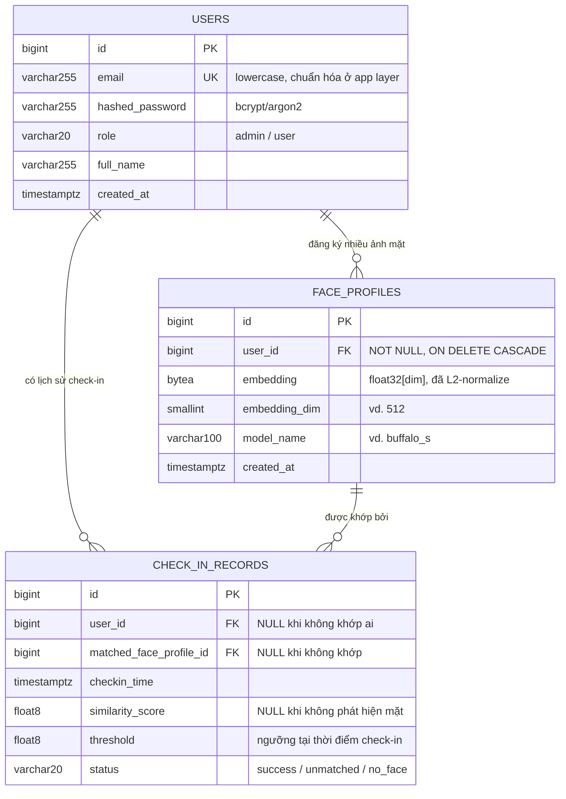

# ERD — Face Check-in Backend

> Mô hình dữ liệu Pha 1. Đi kèm [architecture.md](architecture.md) (phân tầng, luồng xử lý) và [ke-hoach-8-tuan.md](ke-hoach-8-tuan.md) (kế hoạch, API spec).
> Phạm vi: **chỉ 3 bảng**. Mọi thứ không có ở đây là cố ý bỏ (xem mục 9).

## 1. Sơ đồ quan hệ



**Ba quan hệ, đọc theo chiều nghiệp vụ:**

| Quan hệ | Bản chất | Vì sao |
|---|---|---|
| `users` 1 — n `face_profiles` | Một người đăng ký **nhiều** ảnh mặt | Nhiều góc chụp/ánh sáng làm tăng tỉ lệ khớp đúng. Cũng tạo ra đúng bài toán "quét N embedding" để tối ưu ở Pha 2 |
| `users` 1 — n `check_in_records` | Một người có nhiều lượt check-in | Phục vụ `GET /checkins` (lịch sử, filter theo user/ngày) |
| `face_profiles` 1 — n `check_in_records` | Lượt check-in ghi lại **profile nào** đã khớp | Truy vết được "khớp nhờ ảnh nào", hữu ích khi debug ngưỡng similarity |

---

## 2. Bảng `users`

### DDL (PostgreSQL)

```sql
CREATE TABLE users (
    id              BIGINT GENERATED ALWAYS AS IDENTITY,
    email           VARCHAR(255) NOT NULL,
    hashed_password VARCHAR(255) NOT NULL,
    role            VARCHAR(20)  NOT NULL DEFAULT 'user',
    full_name       VARCHAR(255) NOT NULL,
    created_at      TIMESTAMPTZ  NOT NULL DEFAULT now(),
    CONSTRAINT pk_users PRIMARY KEY (id),
    CONSTRAINT uq_users_email UNIQUE (email),
    CONSTRAINT ck_users_role CHECK (role IN ('admin', 'user'))
);
```

*(`id` = `BIGINT GENERATED ALWAYS AS IDENTITY` trên Postgres; xem mục 6 cho SQLite.)*

### Giải thích từng cột

| Cột | Kiểu | Ràng buộc | Ghi chú thiết kế |
|---|---|---|---|
| `id` | BIGINT identity | PK | Số nguyên tăng dần thay vì UUID — index nhỏ hơn, join nhanh hơn, dễ đọc khi debug. Đánh đổi: lộ thứ tự/số lượng user qua URL `/users/{id}`, chấp nhận được vì đã có RBAC chặn truy cập trái phép |
| `email` | VARCHAR(255) | NOT NULL, UNIQUE | **Chuẩn hóa về lowercase + trim ở tầng Service trước khi ghi**, không dùng `CITEXT` của Postgres vì SQLite không có → giữ hành vi giống nhau trên cả 2 DB |
| `hashed_password` | VARCHAR(255) | NOT NULL | bcrypt sinh chuỗi 60 ký tự, argon2id ~97 ký tự → 255 dư sức. **Không bao giờ chứa mật khẩu gốc.** Lưu ý bcrypt cắt mật khẩu ở 72 byte — nếu dùng bcrypt, chặn độ dài ở tầng schema |
| `role` | VARCHAR(20) | NOT NULL, CHECK | Dùng `VARCHAR + CHECK` thay vì `ENUM` native của Postgres: thêm giá trị mới chỉ cần sửa CHECK (SQLite cũng chạy được), trong khi `ALTER TYPE ... ADD VALUE` của Postgres không rollback được trong transaction. Map sang `enum.StrEnum` ở tầng domain |
| `full_name` | VARCHAR(255) | NOT NULL | Hiển thị kết quả check-in ("Xin chào Nguyễn Văn A") |
| `created_at` | TIMESTAMPTZ | NOT NULL | Sinh ở tầng app bằng UTC-aware datetime, **không dựa vào `DEFAULT now()` của DB** (xem mục 6 — SQLite không có timezone) |

### Index

Chỉ cần index của `uq_users_email` (Postgres tự tạo khi khai báo UNIQUE) — phục vụ `POST /auth/login` tra user theo email. Không thêm index nào khác: bảng nhỏ, các truy vấn còn lại đều theo PK.

---

## 3. Bảng `face_profiles`

### DDL (PostgreSQL)

```sql
CREATE TABLE face_profiles (
    id            BIGINT GENERATED ALWAYS AS IDENTITY,
    user_id       BIGINT       NOT NULL,
    embedding     BYTEA        NOT NULL,
    embedding_dim SMALLINT     NOT NULL,
    model_name    VARCHAR(100) NOT NULL,
    created_at    TIMESTAMPTZ  NOT NULL DEFAULT now(),
    CONSTRAINT pk_face_profiles PRIMARY KEY (id),
    CONSTRAINT fk_face_profiles_user_id FOREIGN KEY (user_id)
        REFERENCES users (id) ON DELETE CASCADE,
    CONSTRAINT ck_face_profiles_dim CHECK (embedding_dim > 0)
);

CREATE INDEX ix_face_profiles_user_id ON face_profiles (user_id);
```

### Quyết định quan trọng nhất: lưu embedding thế nào

Đây là cột đáng bàn nhất của toàn bộ schema. Ba phương án:

| Phương án | Dung lượng (512-dim) | Chạy trên SQLite | Nhược điểm |
|---|---|---|---|
| **`BYTEA`/`BLOB` — float32 đóng gói** ✅ chọn | 2048 byte | Có (BLOB) | Không query/so khớp được bằng SQL, phải load lên app để tính |
| `JSON`/`JSONB` mảng float | ~8–10 KB | Có | To gấp 4–5 lần, parse chậm, không có lợi ích thực tế |
| `pgvector` `vector(512)` | ~2052 byte | **Không** | Cần extension; **đẩy logic so khớp xuống DB → vi phạm yêu cầu "nghiệp vụ nằm ở tầng Service"** |

**Chọn `BYTEA`** vì 3 lý do, theo thứ tự quan trọng:
1. **Giữ đúng phân tầng.** Đề bài yêu cầu nghiệp vụ nằm ở tầng Service. So khớp khuôn mặt *là* nghiệp vụ lõi — nếu viết thành `ORDER BY embedding <=> $1 LIMIT 1` thì logic đó chạy trong Postgres, không phải trong `CheckInService`.
2. **Chạy được cả Postgres lẫn SQLite**, đúng stack đã chốt.
3. **Để dành đất cho Pha 2.** Quét tuyến tính N embedding là điểm nghẽn có thật, đo được → chính là chất liệu để đổi sang pgvector/FAISS/HNSW và chứng minh cải thiện bằng số liệu.

### Quy ước mã hóa embedding (bắt buộc tuân thủ)

```python
# Ghi: luôn float32, đã L2-normalize, little-endian
vec = np.asarray(raw_embedding, dtype=np.float32)
vec /= np.linalg.norm(vec)  # invariant: ||vec|| == 1
blob = vec.tobytes()  # 512 * 4 = 2048 byte

# Đọc
vec = np.frombuffer(blob, dtype=np.float32)
assert vec.shape[0] == row.embedding_dim
```

Hai bất biến phải giữ, nếu phá thì kết quả so khớp sai âm thầm (không crash):
- **Luôn `float32`**, không phải `float64` — sai kiểu khi đọc sẽ ra vector dài gấp đôi/nửa mà không báo lỗi.
- **Luôn đã L2-normalize khi ghi** — nhờ đó cosine similarity rút gọn thành tích vô hướng (`np.dot`), bỏ được phép chia chuẩn ở mỗi lần so khớp.

*(Little-endian là mặc định trên x86 và ARM — cả máy dev lẫn Kaggle. Chỉ thành vấn đề nếu bê DB sang kiến trúc big-endian, không xảy ra trong phạm vi đồ án.)*

### Giải thích các cột còn lại

| Cột | Vì sao có |
|---|---|
| `embedding_dim` | Cho phép khẳng định dữ liệu đọc lên đúng độ dài. Nếu Tuần 7 đổi model (vd. 512 → 256 chiều), các profile cũ vẫn tự mô tả được — không phải đoán |
| `model_name` | Embedding của model A **không so khớp được** với embedding của model B. Không có cột này thì khi đổi model ở Pha 2, dữ liệu cũ trở thành rác không nhận biết được. Rẻ mà cứu được một lớp bug khó chịu |
| `ON DELETE CASCADE` | Xóa user thì hồ sơ khuôn mặt phải biến mất cùng — đây là dữ liệu sinh trắc học, không giữ lại mồ côi |
| `ix_face_profiles_user_id` | Phục vụ `GET /face-profiles?user_id=` và kiểm tra quyền sở hữu trước khi `DELETE /face-profiles/{id}`. Postgres **không** tự tạo index cho FK |

---

## 4. Bảng `check_in_records`

### DDL (PostgreSQL)

```sql
CREATE TABLE check_in_records (
    id                      BIGINT GENERATED ALWAYS AS IDENTITY,
    user_id                 BIGINT      NULL,
    matched_face_profile_id BIGINT      NULL,
    checkin_time            TIMESTAMPTZ NOT NULL DEFAULT now(),
    similarity_score        DOUBLE PRECISION NULL,
    threshold               DOUBLE PRECISION NOT NULL,
    status                  VARCHAR(20) NOT NULL,
    CONSTRAINT pk_check_in_records PRIMARY KEY (id),
    CONSTRAINT fk_check_in_records_user_id FOREIGN KEY (user_id)
        REFERENCES users (id) ON DELETE SET NULL,
    CONSTRAINT fk_check_in_records_profile_id FOREIGN KEY (matched_face_profile_id)
        REFERENCES face_profiles (id) ON DELETE SET NULL,
    CONSTRAINT ck_check_in_records_status
        CHECK (status IN ('success', 'unmatched', 'no_face')),
    CONSTRAINT ck_check_in_records_success_shape CHECK (
        status <> 'success'
        OR (user_id IS NOT NULL AND similarity_score IS NOT NULL)
    )
);

CREATE INDEX ix_check_in_records_user_time
    ON check_in_records (user_id, checkin_time DESC);
CREATE INDEX ix_check_in_records_time
    ON check_in_records (checkin_time DESC);
```

### Ba trạng thái, và vì sao `user_id` được phép NULL

`POST /checkins` nhận **ảnh của một người chưa biết là ai** — mục đích chính của endpoint là *xác định* người đó. Nên có 3 kết cục, và cả 3 đều phải ghi lại (lịch sử thất bại là dữ liệu giá trị để hiệu chỉnh ngưỡng):

| `status` | Ý nghĩa | `user_id` | `similarity_score` | HTTP trả về |
|---|---|---|---|---|
| `success` | Điểm cao nhất ≥ ngưỡng | có | có | 201 |
| `unmatched` | Có phát hiện mặt, nhưng điểm cao nhất < ngưỡng | NULL | có (điểm cao nhất đạt được) | 200 hoặc 404 — chốt ở [architecture.md](architecture.md) |
| `no_face` | Không phát hiện được khuôn mặt nào trong ảnh | NULL | NULL | 422 |

Ràng buộc `ck_check_in_records_success_shape` biến quy tắc trên thành thứ **DB tự bảo vệ**: không thể ghi một bản ghi `success` mà không biết là ai. Bug tầng Service sẽ lỗi ngay khi INSERT, thay vì âm thầm sinh dữ liệu vô nghĩa.

### Vì sao lưu cả `threshold`

`similarity_score = 0.42` tự nó **không nói lên điều gì** — thành công hay thất bại còn tùy ngưỡng lúc đó là 0.35 hay 0.5. Nhóm gần như chắc chắn sẽ chỉnh ngưỡng vài lần trong Tuần 3–4, và sẽ đổi model ở Pha 2. Không lưu ngưỡng thì toàn bộ lịch sử check-in cũ mất khả năng diễn giải. Một cột `DOUBLE PRECISION` là cái giá rất rẻ cho việc đó.

### Vì sao `ON DELETE SET NULL` (không phải CASCADE)

Lịch sử check-in là **dữ liệu chấm công** — xóa user không nên làm bốc hơi bằng chứng "9 giờ sáng hôm đó có người check-in thành công". `SET NULL` giữ lại dòng thời gian, chỉ bỏ liên kết danh tính. *(Ở hệ thống thật, quyền riêng tư có thể yêu cầu ngược lại — nhưng đó là quyết định tuân thủ, không phải mặc định kỹ thuật.)*

### Index phục vụ truy vấn nào

`GET /checkins` theo API spec có filter theo user và theo ngày:

```sql
-- Có filter user: dùng ix_check_in_records_user_time (cả 2 cột)
SELECT * FROM check_in_records
 WHERE user_id = $1 AND checkin_time >= $2 AND checkin_time < $3
 ORDER BY checkin_time DESC LIMIT 50;

-- Không filter user (admin xem toàn bộ): dùng ix_check_in_records_time
SELECT * FROM check_in_records
 WHERE checkin_time >= $1 ORDER BY checkin_time DESC LIMIT 50;
```

Index composite `(user_id, checkin_time DESC)` phục vụ truy vấn 1; nó **không** phục vụ được truy vấn 2 (thiếu cột dẫn đầu) nên cần index thứ hai. Đây cũng là số liệu tốt cho Pha 2: đo `EXPLAIN ANALYZE` trước/sau khi thêm index.

---

## 5. Bảng ánh xạ 3 lớp biểu diễn

Cùng một khái niệm tồn tại ở 3 dạng khác nhau. Nhầm lẫn giữa chúng là lỗi phân tầng phổ biến nhất:

| Khái niệm | ORM model (`app/models/`) | Domain entity (`app/domain/entities.py`) | API schema (`app/schemas/`) |
|---|---|---|---|
| Người dùng | `UserORM` — có `Mapped[...]`, gắn session | `User` dataclass — thuần Python | `UserRead` (không có password), `UserCreate` (có password gốc) |
| Hồ sơ mặt | `FaceProfileORM` — `embedding: bytes` | `FaceProfile` — `embedding: np.ndarray` đã giải mã | `FaceProfileRead` — **không trả embedding ra API** |
| Lượt check-in | `CheckInRecordORM` | `CheckInRecord` | `CheckInResult` — thêm `full_name` cho tiện hiển thị |

Hai quy tắc rút ra:
- **Repository là nơi duy nhất được chuyển đổi ORM ↔ domain.** Tầng Service không bao giờ nhìn thấy `UserORM`.
- **Không trả `embedding` ra API.** Đó là dữ liệu sinh trắc học; lộ ra là mất an toàn mà chẳng phục vụ use-case nào.

---

## 6. Khác biệt Postgres ↔ SQLite (phải xử lý từ đầu)

Stack đã chốt chạy **Postgres cho docker-compose/benchmark** và **SQLite cho test nhanh**. Bốn điểm lệch sau sẽ cắn nếu phát hiện muộn:

| Chủ đề | PostgreSQL | SQLite | Cách xử lý |
|---|---|---|---|
| Khóa chính tự tăng | `BIGINT GENERATED ALWAYS AS IDENTITY` | `INTEGER PRIMARY KEY AUTOINCREMENT` | Khai báo `BigInteger, primary_key=True` trong SQLAlchemy và để nó tự sinh DDL đúng cho từng dialect |
| Nhị phân | `BYTEA` | `BLOB` | Dùng `sqlalchemy.LargeBinary` — map đúng cho cả hai |
| Thời gian | `TIMESTAMPTZ` có timezone | `TIMESTAMP` **không** có timezone | **Luôn sinh `datetime.now(timezone.utc)` ở tầng app**, không dùng `server_default=now()`. Nếu không, so sánh thời gian sẽ lệch giữa test và prod |
| Khóa ngoại | Luôn bật | **Tắt mặc định** | Bật `PRAGMA foreign_keys=ON` mỗi connection, nếu không `ON DELETE CASCADE` im lặng không chạy và test sẽ *pass sai* |

Cả 4 điểm trên đã được xử lý trong [`app/models/base.py`](../app/models/base.py) (pragma bật FK, `PkType` đổi biến thể theo dialect) và trong từng file model.

---

## 7. Alembic — quy ước để migration không vỡ

### Đặt tên ràng buộc ngay từ migration đầu

`NAMING_CONVENTION` đã khai báo sẵn trong [`app/models/base.py`](../app/models/base.py) — **đừng bỏ nó đi.**

Lý do: SQLite **không hỗ trợ `ALTER TABLE DROP CONSTRAINT`**. Alembic vượt qua bằng `batch_alter_table` (tạo bảng mới → copy → đổi tên), nhưng thao tác đó cần **biết tên ràng buộc**. Nếu để DB tự đặt tên ẩn danh, mọi migration đụng tới constraint sẽ fail trên SQLite. Thêm 8 dòng ở migration đầu rẻ hơn nhiều so với gỡ ở Tuần 4.

### Bao gồm `role` ngay từ migration đầu tiên

Checklist Tuần 4 ghi *"thêm field `role` cho User (nếu chưa có)"*. Vì ERD này đã có `role` từ đầu, **hãy đưa nó vào migration `0001`** — việc Tuần 4 của A rút gọn còn *seed tài khoản `admin`/`user` mẫu*. Ít hơn một migration, ít hơn một lần sửa bảng trên SQLite.

### Kiểm chứng bắt buộc trước khi đóng Tuần 2

```bash
alembic upgrade head    # từ DB rỗng, trên cả Postgres và SQLite
alembic downgrade base  # phải chạy sạch, không lỗi
alembic upgrade head    # lên lại được
```

Migration chỉ "chạy được một chiều" là migration hỏng — phát hiện ở Tuần 6 lúc bàn giao thì đã muộn.

---

## 8. Dữ liệu mẫu (seed)

Checklist bàn giao yêu cầu seed script để nhóm nhận hệ thống có dữ liệu test ngay. Tối thiểu:

| Bảng | Số dòng | Nội dung |
|---|---|---|
| `users` | 3 | 1 `admin`, 2 `user` — mật khẩu **giả, ghi rõ trong README**, không phải secret thật |
| `face_profiles` | 2–4 | Sinh từ vài ảnh mẫu công khai (hoặc ảnh của chính thành viên nhóm, có đồng ý) |
| `check_in_records` | ~10 | Trộn cả `success` và `unmatched`, rải trên vài ngày để test filter theo ngày |

Seed phải **idempotent** (chạy 2 lần không nhân đôi dữ liệu) — kiểm tra tồn tại theo `email` trước khi insert.

> ⚠️ Không commit ảnh khuôn mặt của người thật vào repo công khai nếu chưa có sự đồng ý rõ ràng. An toàn nhất: seed sinh embedding ngẫu nhiên đã normalize cho `face_profiles`, kèm ghi chú rằng đó là dữ liệu tổng hợp.

---

## 9. Những gì cố tình KHÔNG có ở Pha 1

Đề bài ghi rõ *"Chỉ triển khai chức năng cơ bản, không cần tối ưu"*. Các thứ dưới đây đã được cân nhắc và **loại bỏ có chủ đích** — ghi lại ở đây để nhóm nhận hệ thống ở Pha 2 biết đây là lựa chọn, không phải thiếu sót:

| Không làm | Lý do |
|---|---|
| Bảng `refresh_tokens` | Pha 1 chỉ cần access token. Rotate refresh token là một cải tiến Security ứng viên của Pha 2 |
| Soft delete (`deleted_at`) | Không có yêu cầu khôi phục. `DELETE` là xóa thật, đơn giản và đúng kỳ vọng |
| `updated_at` | Không có endpoint UPDATE nào trong API spec Pha 1 |
| Bảng audit log riêng | `check_in_records` đã là audit trail cho nghiệp vụ duy nhất cần nó |
| pgvector / FAISS index | Chính là cải tiến Pha 2 — làm sẵn ở Pha 1 thì mất đề tài và mất cả baseline để so sánh |
| Phân vùng (partition) `check_in_records` theo tháng | Chỉ có nghĩa ở quy mô hàng triệu dòng; benchmark Kaggle không chạm tới ngưỡng đó |

---

## 10. Ước lượng dung lượng & điểm nghẽn dự kiến

Con số dưới đây là **ước lượng để định hướng**, phải xác nhận lại bằng benchmark thật ở Tuần 6:

| Hạng mục | Ước tính |
|---|---|
| 1 embedding 512-dim float32 | 2 048 byte |
| 1 000 user × 2 profile | ~4 MB — toàn bộ nhét vừa RAM thoải mái |
| So khớp 2 000 profile bằng 1 phép nhân ma trận numpy | dưới 1 ms |
| Detect + embed 1 ảnh trên CPU | **~50–200 ms** |

Kết luận sơ bộ: ở quy mô đồ án, **điểm nghẽn nằm ở suy luận model, không phải ở DB hay ở vòng lặp so khớp**. Đây là lý do cải tiến Pha 2 nên ưu tiên hướng ONNX/quantization/cache embedding trước khi nghĩ đến ANN index — nhưng **chỉ chốt sau khi có số đo thật** ở Tuần 6–7, đúng nguyên tắc đã ghi trong kế hoạch.
